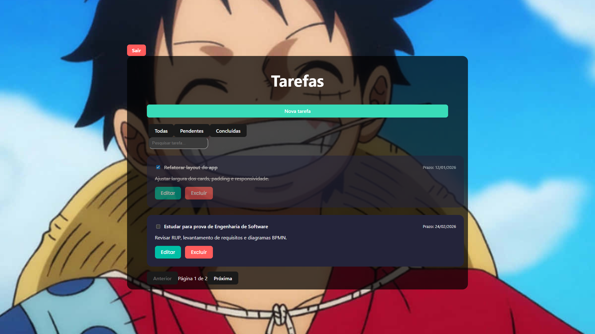

# 📝 Tasks App - C#
Aplicação web de gerenciamento de tarefas (To-Do List) desenvolvida com Vue 3 e Vite, integrada a um backend em ASP.NET Core, com foco em uma interface moderna, responsiva e intuitiva.

O projeto permite criar, editar, concluir, excluir e filtrar tarefas, além de contar com paginação, busca em tempo real e autenticação de usuários.

---

## 🚀 Funcionalidades
✅ Criar tarefas com título, descrição e prazo

✏️ Editar tarefas existentes

🗑️ Excluir tarefas

☑️ Marcar tarefas como concluídas

🔍 Buscar tarefas por título ou descrição

🎯 Filtrar tarefas (todas, pendentes, concluídas)

📄 Paginação de tarefas

🎨 Interface moderna com modal, blur e animações

🖋️ Fonte Poppins

📱 Layout responsivo

👤 Registro de usuários com validação de campos

🔑 Login com autenticação via JWT Token

🚪 Logout e gerenciamento de sessão

🛡️ Proteção de rotas (somente usuários autenticados acessam as tarefas)

⚠️ Validações de senha (mínimo de 6 caracteres) com mensagens de erro claras no frontend

📧 Verificação de e-mail duplicado no registro

🕒 Campos de auditoria (CreatedAt, UpdatedAt) para usuários e tarefas

---

## 📸 Interface

### 📋 Lista de tarefas

### 🔐 Login/Registro de usuário

---

## 🛠️ Tecnologias utilizadas
### Frontend
Vue 3

Vite

Composition API

CSS moderno (Grid / Flexbox)

Axios (para comunicação com API)

--

### Backend
ASP.NET Core

Entity Framework Core

JWT para autenticação

Validações com DataAnnotations

Outros

Git & GitHub

---

## ▶️ Como rodar o projeto localmente
### 1️⃣ Clone o repositório
bash
git clone git@github.com:andrewSouza-dev/tasks-app.git

--

### 2️⃣ Acesse a pasta do projeto
bash
cd tasks-app

--

### 3️⃣ Instale as dependências
bash
npm install

--

### 4️⃣ Inicie o servidor de desenvolvimento
bash
npm run dev

--

### 5️⃣ Backend
Certifique-se de que a API em ASP.NET Core esteja rodando para o funcionamento completo do CRUD e autenticação.

---

## 📌 Observações
O backend deve estar rodando para o funcionamento completo do CRUD e autenticação.

O formato de data é tratado no frontend para exibição amigável.

O projeto foi desenvolvido com foco em boas práticas, componentização e legibilidade de código.

---

## 👨‍💻 Autor
Andrew Souza
GitHub: @andrewSouza-dev

---

## 📄 Licença
Este projeto está sob a licença MIT.
Sinta-se livre para usar, estudar e modificar.